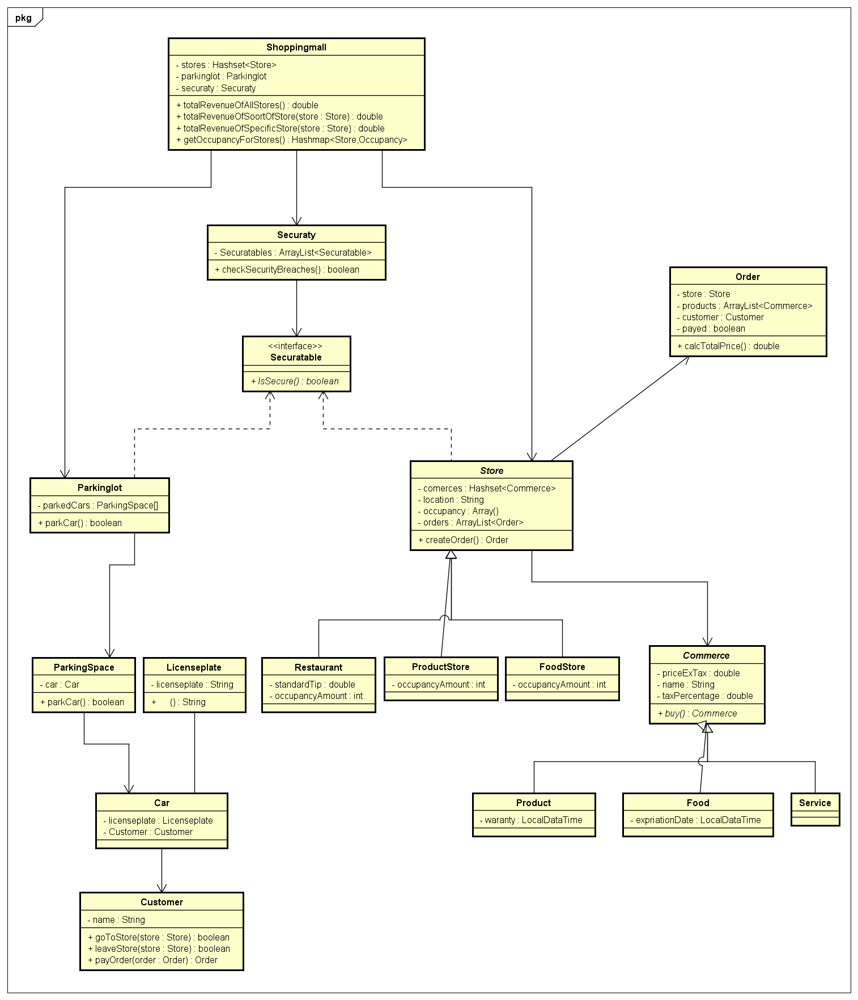

# Startdocument voor het winkelcentrum

## Startdocument van **Steffan van der Werf en Chris Klunder**.

# Probleem omschrijving
In Dubai is sinds kort een nieuw winkelcentrum geopend. Dit winkelcentrum bevat allerlei soorten winkels. Veel winkels bieden producten aan, andere bieden diensten aan en ook nog enkele alleen etenswaren. Er is daarnaast ook nog een parkeergelegenheid voor 90 auto's.

Alle klanten hebben de mogelijkheid om aankopen te doen in een winkel. Hierbij moeten ze de totale prijs van hun aankopen op kunnen vragen. Als de klant een winkel verlaat zonder te betalen, moet er een exception komen.

Wegens recente onveiligheden, heeft het winkelcentrum besloten om beveiliging in te schakelen. In elke soort winkel mogen nog maar 20 personen tegelijkertijd komen met uitzondering van het restaurant. Hier mogen er maximaal 40 personen tegelijkertijd aanwezig zijn. Op de parkeerplaats mogen er nog maar 75% van de totale 90 plekken bezet zijn om de rust beter te bewaren. 

Het winkelcentrum wil graag de volgende dingen weten van de winkels:
- De totale omzet van alle winkels
- De totale omzet per soort winkel
- De omzet per winkel
- De bezetting per winkel

### Invoer & Uitvoer

In dit stuk gaan wij de in- en uitvoer producten beschrijven. 
#### Input

In de tabel hier onder gaan zal de input van de gebruiker worden omschreven.

|Case|Type|Conditie|
|----|----|----------|
||||

#### Output

|Case|Type|
|----|---|
| ||

#### Berekeningen

| Case              | Calculation                        |
|-------------------| ---------------------------------- |
|            |  |

#### Opmerkingen

* Input word gecontroleerd

## Klassen diagram

## Testplan

in dit hoofstuk worden de testcases omschreven die gebruikt worden om de applicatie te testen.

### Test Data

In de volgende tabellen staat alle data die nodig zijn om de applicatie te testen
#### Club

| ID           | Input                                    | Code                                |
|--------------|------------------------------------------|-------------------------------------|
| ``           |                                          | ``                                  |
| ``           |                                          | ``                                  |

### Testgevallen

In dit hoofstuk zullen de stappen omschreven worden die als basis dienen voor het uitvoeren van de test.

#### #1 
| Step | Input        | Action                 | Expected output |
| ---- | ------------ | ---------------------- | --------------- |
| 1    | `` | `` |                 |
| 2    | `` | `` |                 |
| 3    | `` | `` |                 |